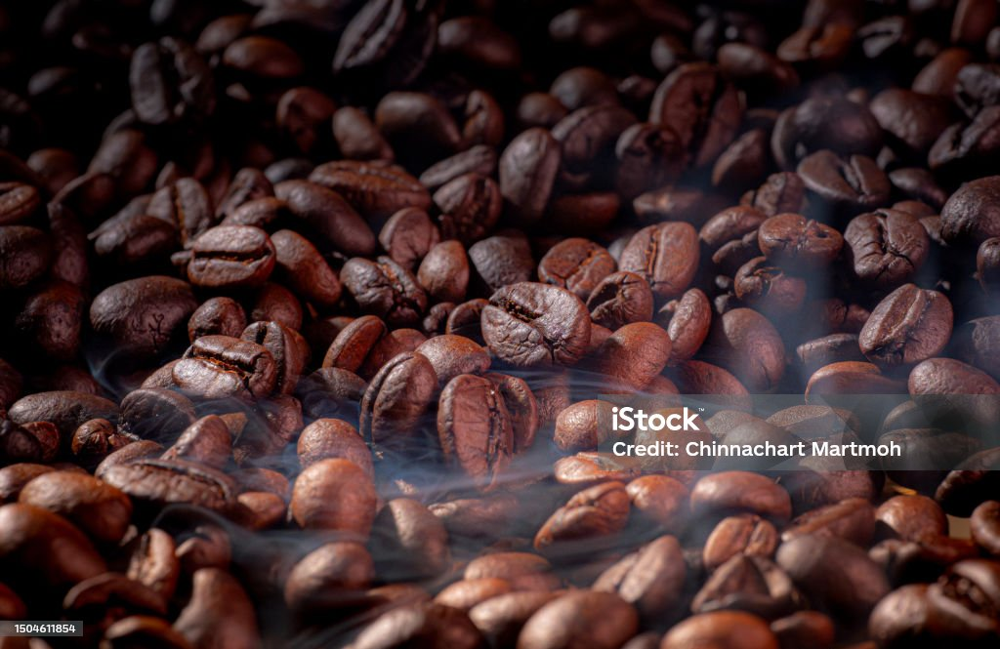

# Tittle: Analysis-of-Coffee-Sale-Dashboard

# Table of contents

- [Objective](#objective)
- [Data source](#data-source)
- [Stages](#stages)
- [Data cleaning](#data-cleaning)
- [Visualization](#visualization)
- [Analysis](#analysis)
 - [Findings](#findings)
 - [Discovery](#discovery)
- [Recommendations](#recommendations)
- [Conclusion](#conclusion)

# Objective

- What is the key main point?
The aim of this project is to build an interactive microsoft excel dashboard to allow the users to quickly identify trends in the coffee base sales as well as perform exploratory data analysis on the available datasets to generate actionable insights and recommendations.

- What is the ideal solution?
  
 To create a dashboard that provides insights into the coffee sales anaysis, which includes their
- total sales 
- time trend anaysis of coffee sales overtime
- top customer
- top country orders

This will help the coffee shop to make informed decisions on where to maximum is order to.

# Data source

- What data is needed to achieve this objective?

We need data on the coffe orders, consumers and product which includes their

- order countery
- time period
- coffee type
- customers, order and product ID
- size

# Stages

-Examine both product, order and customer datasets for inconsistencies, missing values, outliers, correctly identify categorical and numerical data.
-Define metrics such as total sales, time trend, and the top sales by country.
-Explore the data, create charts and graphs to visualise trends and insights for business recommendations.

# Data cleaning

- What do we expect the clean data to look like?
- What should it contain?
- What limitations should we apply to it?

The aim is to refine our dataset to ensure it is structured and ready for analysis.

The cleaned data should meet the following criteria and constraints:
- Only relevant columns should be retained.
- All data types should be appropriate for the contents of each column.
- No column should contain null values, indicating complete data for all records.

# Visualization

## Results
- What does the dashboard look like?
  

This shows the coffee sales dashboard.

# Analysis

## Findings
- What did we find?
For this analysis, we’re going to focus on the questions below to get the information we need for our client.

Here are the key questions we need to answer for our client:

1. Who are the top sales by country?
2. Top 5 customers by sales?
3. top sale over the years?

### 1. Who are the top sales by country?

### 2. Top 5 customers by sales?

### 3. top sale over the years?

# Discovery

- What did we learn?

We discovered that
1. United State is the highest order sales by country, followed by Ireland, with United Kingdom being the last top sales by country.
2. Don Flintiff, Nealson Cuttler, Terri Farra, Brenn Dundredge and Allis are the to[ customers by sales.
3. 2021 was the year with the highest sales with a sum of *$13,766*, 2020 sales was *$12,118*, 2019 sales was a total of *$12,187*, and lastly 2022 which was the lowest sales with a sum of *$7,063*.

 # Recommendations

- What do you recommend based on the insights gathered?

1. Dan Rhodes is the best YouTube channel to collaborate with if we want to maximize visbility because this channel has the most YouTube subscribers in the UK.
2. Although GRM Daily, Man City and Yogcasts are regular publishers on YouTube, it may be worth considering whether collaborating with them with the current budget caps are worth the effort, as the potential return on investments is significantly lower compared to the other channels.
3. Mister Max is the best YouTuber to collaborate with if we’re interested in maximizing reach, but collaborating with DanTDM and Dan Rhodes may be better long-term options, considering the fact that they both have large subscriber bases and are averaging significantly high number of views.
4. The top 3 channels to form collaborations with are NoCopyrightSounds, DanTDM and Dan Rhodes based on this analysis, because they attract the most engagement on their channels consistently.

# Conclusion

Base on the findings and analysis of the viewership and views per subscriber, Dan Rhodes appears to be the best option to advance with due to higher returns of investment compared to other channels.
Hence the conclusion was that the head of marketing, will work with Dan Rhodes to run it`s current marketing campaing throughout the rest of the year as per the analysis. 

